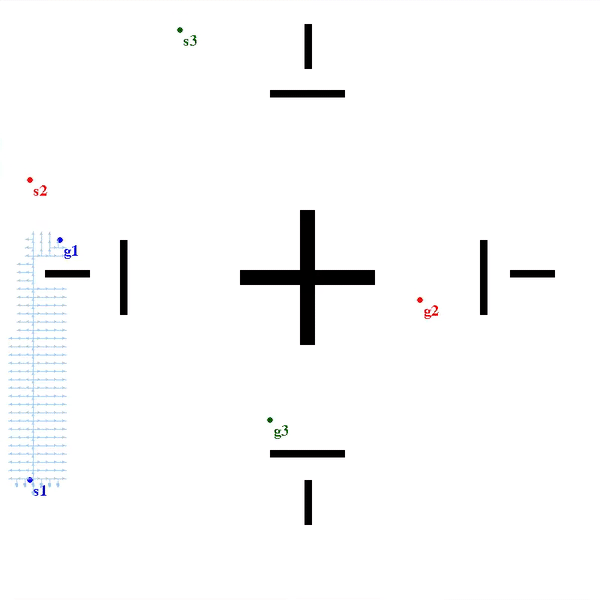
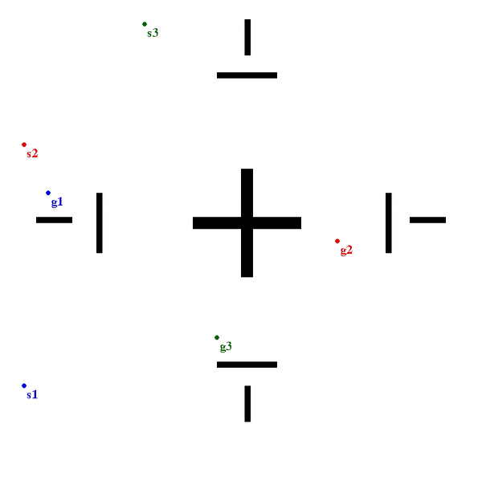
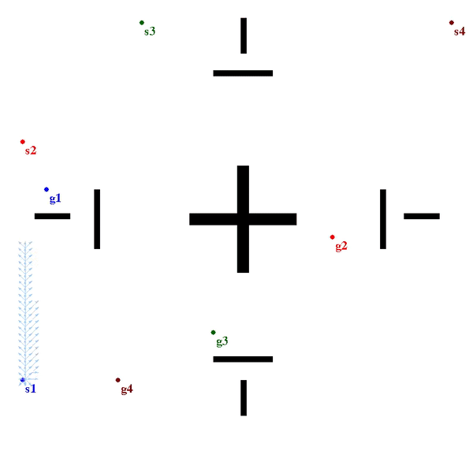
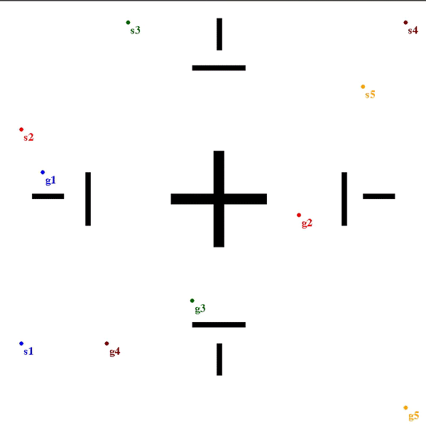
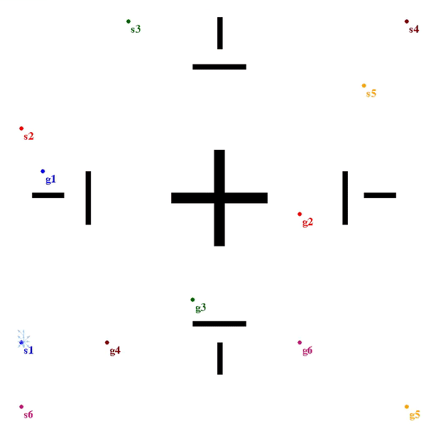
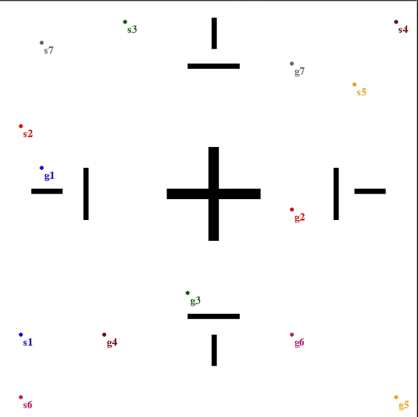
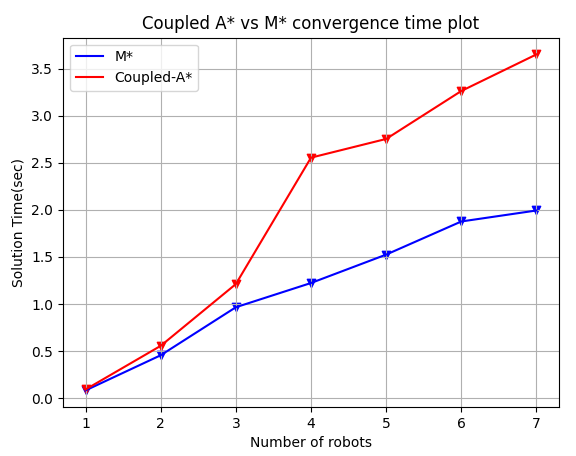

# Multi-agent Pathplanning
## Overview
The project implements M* algorithm[1] for multi-agent systems in python. This project was done as a part of independent study course ENSE699 under the supervision of Dr. Micheal Otte in University of Maryland. 

## Libraries Used
1. Pygame for visulization
2. Numpy

## How to run M* algorithms
 In order to run M* program and visualize the output please uncomment lines:
 1. 457-458 to implement M* algorithm for 1-robot
 2. 461-462 to implement M* algorithm for 2-robot
 3. 465-468 to implement M* algorithm for 3-robot
 4. 471-474 to implement M* algorithm for 4-robot
 5. 477-480 to implement M* algorithm for 5-robot
 6. 483-486 to implement M* algorithm for 6-robot
 7. 489-494 to implement M* algorithm for 7-robot

and run the following command:
```
python3 M_star.py
```


## Outputs
The M* algorithm was tested for 2,3,4,5,6 and 7 robots by specifying start and goal position to each robot and obtain a collision free path from the algorithm. The algorithm is also compared with Coupled-A* algorithm and below gif shows the side by side ouput comparision of two algorithms:
```
Output for 3 Robots 
```
<p float="left">
  
   
</p>

```
Output for 4 Robots 
```
<p float="left">
  
   
</p>

```
Output for 5 Robots 
```
<p float="left">
  
   
</p>

```
Output for 6 Robots 
```
<p float="left">
  
   
</p>

```
Output for 7 Robots 
```
<p float="left">
  
   
</p>

```
Convergence time plot output M* vs Coupled A*
```
<p align="center">
  
</p>

## References
1. G. Wagner and H. Choset, ”M: A complete multirobot path planning algorithm with performance bounds,” 2011 IEEE/RSJ International Conference on Intelligent Robots and Systems, 2011, pp.3260-3267, doi: 10.1109/IROS.2011.6095022.

